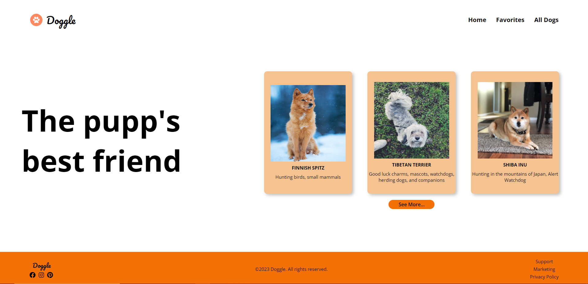

# Doggle

|      MOBILE         |          DESKTOP       |
|:-------------------:|:-----------------------:
|||
|                     |                        |

### [Clique aqui](https://thedog-api.netlify.app) para acessar o site!

---
## Sobre
O objetivo deste projeto é colocar em prática os conhecimentos sobre desenvolvimento de sites, no módulo de PWFE (Programação Web FrontEnd) adquiridos no curso do [SENAI Jandira](https://jandira.sp.senai.br/) utilizando javascript puro!

---

## Tecnologias utilizadas:
- CSS
- HTML
- Figma
- Netlif
- Markdown
- JavaScript
- Responsividade
---

## Figma:
[Clique aqui](https://www.figma.com/file/Ej97xKnXEmp16HBn0TWQj1/Untitled?type=design&node-id=0-1&t=U1MliSyrVwCcQ3p9-0) para acessar o layout feito no figma.

---
## Critérios de Avaliação

- []  Documentou problemas, se encontrado, para futuras consultas?
- [x]  Foi criado o layout no figma?
- [x]  A página foi construída seguindo o planejado no Figma?
- [x]  A página funciona em dispositivos diferentes?
- [x]  Foi consumida a API escolhida?
- []  Foi criado web componentes?
- [x]  Foi criado um padrão de roteamente para as paginas?
- [x]  As funções foram criadas seguindo à boa prática de responsabilidade única?
- [x]  Quando possível, foi criado funções puras?
- [x]  O projeto está publicado?
- [x]  Foi criado o arquivo README.md?

---

## Autor 
- [Ingryd Shirlley](https://github.com/ingryd16)
